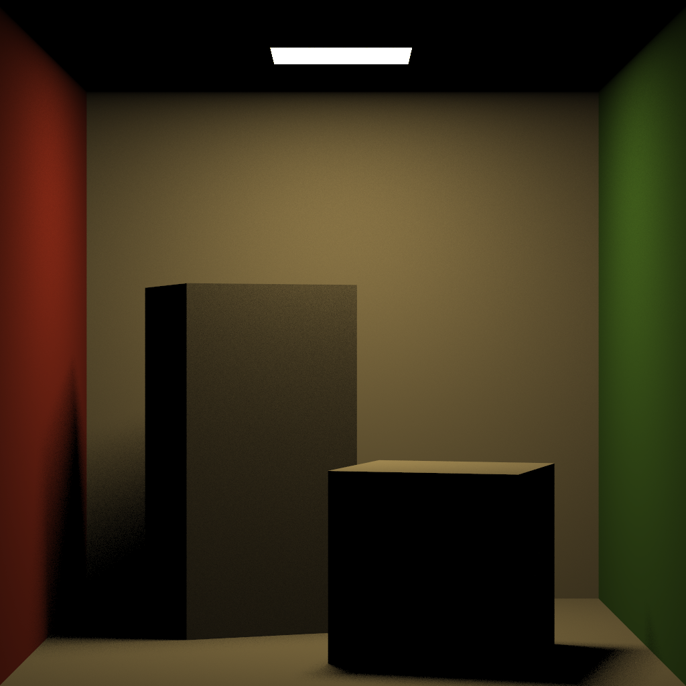
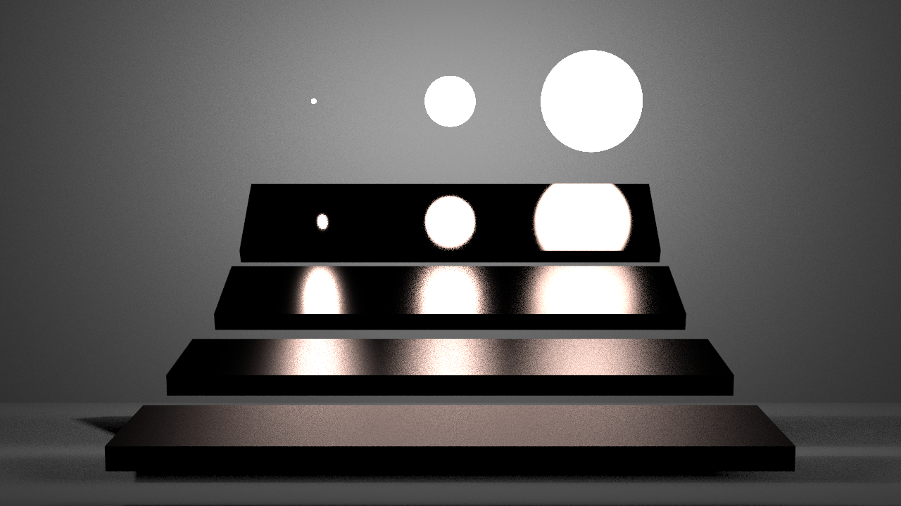

# Harunobu

A physically based renderer implemented by C++.

## Features
- Ray tracing
- Shading
  - Direct illumination with multiple importance sampling
- Materials
  - Diffuse
  - Microfacet -> Beckmann
- Geometry
  - Triangle, sphere
- Reconstruction Filter
  - Box, Tent
- Image pipeline
  - Gamma correction
- Scene
  - Mitsuba-styled scene file (not completely supported)

## Installation
Harunobu is only supported under linux system currently.

1. Install bazel
2. `./release.sh run <scene_path> <result_png_path>`

## Gallery

Cornell box (direct illumination).

Veach MIS scene (direct illumination).